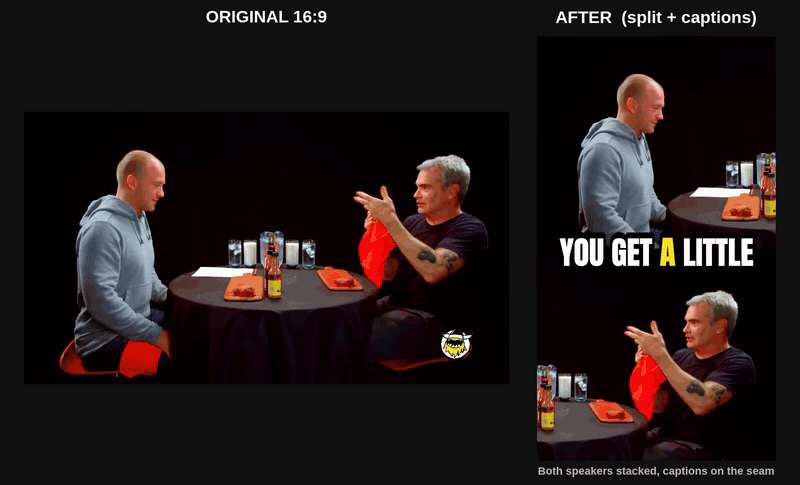
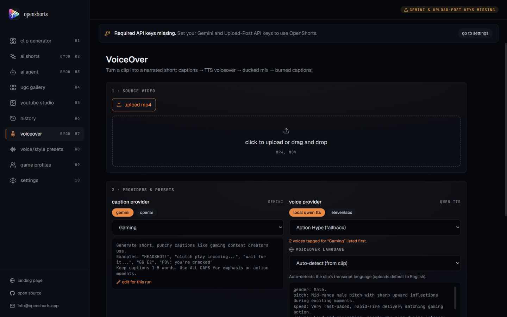
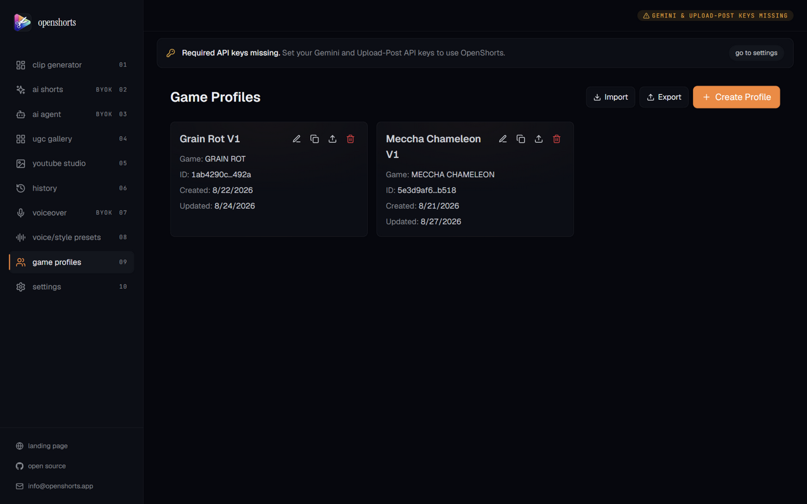
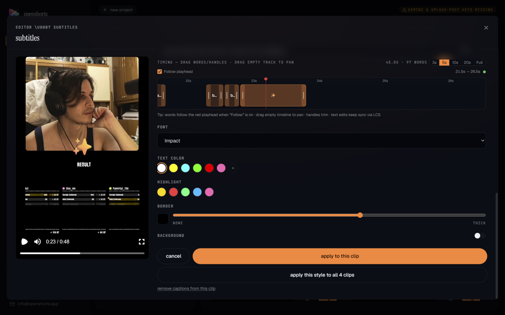
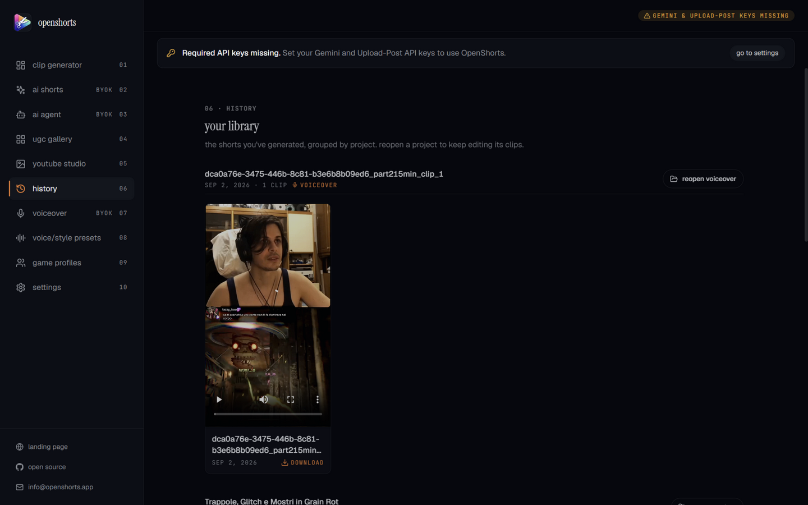
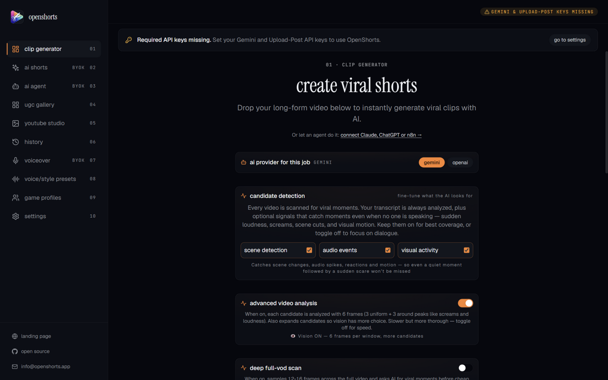
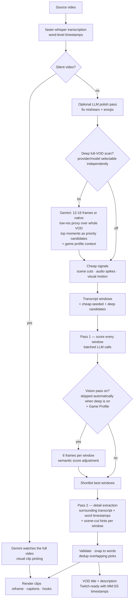
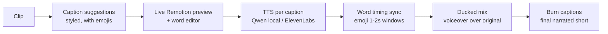

# OpenShorts.app

[](https://opensource.org/licenses/MIT)
[](https://opensource.org/)
[](http://makeapullrequest.com)
[](https://docs.docker.com/compose/)
[](https://github.com/mutonby/openshorts)
[](https://github.com/mutonby/openshorts/commits/main)

**Open source AI video platform** with 5 tools in one: **Clip Generator**, **AI Shorts (UGC videos with AI actors)**, **YouTube Studio**, **VoiceOver (AI-narrated shorts)** and **Game Profiles (per-game viral scoring)**.



Two people on camera? OpenShorts stacks them instead of shrinking the wide shot, puts the captions on the seam where they cover nobody, and switches back to a face-tracked crop when the cut goes to one person. The AI picks the layout per video; nothing to configure.

**Two ways to run it, same software either way:**

|  | Self-hosted (this repo) | Hosted on [openshorts.app](https://www.openshorts.app/) |
|---|---|---|
| **Price** | Free forever, MIT | Free plan, paid from $12/mo |
| **Speed** | 5 to 8 min per 8-min video on CPU | About 50s on our NVIDIA GPU |
| **API keys** | Bring your own Gemini, ElevenLabs, fal.ai | Gemini included, nothing to set up |
| **Watermark / limits** | None, ever | Watermark and 20 min/mo on the free plan, neither on paid |
| **Setup** | Docker, 8GB+ RAM, model downloads | Sign in and paste a link |
| **MCP / API for agents** | Same `/mcp` endpoint, but only while your machine is on | Always-on endpoint at [mcp.openshorts.app](https://www.openshorts.app/mcp), API keys in one click |
| **Your data** | Your server | Ours |

Self-hosting is genuinely free and always will be. It costs you a machine, your own API keys and the time to keep it running. The hosted plans exist to cover that hardware and those keys, not to unlock features.

https://github.com/user-attachments/assets/b45fa983-16b4-48b5-ac5b-a267836b9ad9


### Video Tutorial: How it works
[](https://www.youtube.com/watch?v=xlyjD1qCaX0 "Click to watch the video on YouTube")

*Click the image above to watch the full walkthrough.*

---

## 5 Tools in 1 Platform

### 1. Clip Generator
Turn your long-form videos — podcasts, webinars, livestreams, vlogs, interviews — into viral-ready 9:16 shorts for TikTok, Instagram Reels, and YouTube Shorts.


### 2. AI Shorts (UGC Video Creator)
Generate marketing videos with AI actors for **any product or business**. No camera, no studio, no influencer budget. Just describe your product or paste a URL.


- **Two cost modes**: Low Cost (~$0.65/video) and Premium (~$2/video)
- Works for any business: SaaS, restaurants, e-commerce, coaching, local businesses
- AI-generated actors with lip-sync, voiceover, b-roll, and TikTok-style subtitles
- Choose from a shared avatar gallery or upload your own photo
- Publish directly to TikTok, Instagram, and YouTube

### 3. YouTube Studio
Complete free AI YouTube toolkit: thumbnails, titles, descriptions, and direct publishing.


- AI thumbnail generator with face overlay
- 10 viral title suggestions with refinement chat
- Auto-generated descriptions with chapter timestamps
- One-click publish to YouTube

### UGC Video Gallery
All generated videos and avatars are saved to a public gallery with SEO pages for each video.


- Public gallery page with hover-to-play (`/gallery`)
- Individual SEO video pages with og:video meta tags (`/video/{id}`)
- JSON-LD structured data for search engines
- Avatar gallery with prompt history

### 4. VoiceOver — AI-narrated shorts with styled captions
Turn any clip into a narrated short: AI caption suggestions → TTS voiceover → ducked mix → burned captions, all in one guided workflow.



- **Caption suggestions with live preview**: the AI proposes caption sets (Gaming, Dramatic, GenZ, Creepypasta…), each one previewed in a real Remotion player beside the options — words highlight as the clip plays, exactly like the final burn
- **Two TTS providers**: local **Qwen3-TTS VoiceDesign** (free, runs on your GPU, 12-dimension voice personas) or **ElevenLabs** — selectable per job
- **Voice & Style Presets manager**: 10 seeded voice personas and 10 caption style prompts, fully editable. Voice presets are tagged with caption styles (a "Gaming Hype" voice carries the `gaming` tag); picking a style reorders matching voices to the top of the dropdown and auto-selects the first one
- **Emoji-aware captions**: the LLM sprinkles emojis into captions, timed to hold 1–2 s on screen; display text keeps emojis while the spoken audio stays clean. Emoji words burn through Remotion's **AnimatedEmoji** set (Google/Android animation), and every later re-style of the clip (subtitle editor, hook, recut) re-burns through the same path so the animation survives chaining
- **Non-English TTS done right**: Italian (and any language) gets slang expansion (`nn` → *non*, `1v1` → *uno contro uno*), number-to-words conversion, and article-elision splitting so the voice says *"l' ho fatto"* correctly — while burned captions keep the natural written form
- **Auto ducking**: background audio is sidechain-compressed under the narration and the mix is extended if the voiceover runs long
- **Session persistence**: switch tabs or refresh mid-generation and the workflow keeps its state; projects reopen from History with captions restored

### 5. Game Profiles — tune viral scoring per game


- **Steam auto-import**: type the game name, pick the match from live Steam search — the profile pulls the official description, genres and tags automatically (or fill everything by hand)
- **AI analysis on demand**: one click runs an LLM analysis over the Steam data to produce game type, gameplay characteristics and the **key moments that matter for virality** (clutches, fails, jumpscares…), suggested weights are copied onto the profile with one click
- **Custom prompt / notes**: your own instructions get prompt priority in every selection pass — *"prefer clutch saves"* or *"find the funny fails"* steer clip selection explicitly
- **Where it applies**: cheap-signal seeding, transcript scoring, the deep full-VOD scan and the semantic vision pass all receive the profile context, so a horror game is judged on scares and a fighter on combos
- Profiles are stored, editable, importable/exportable

### 6. Subtitle editor — style every word, preview live


Open on any generated clip for a full caption studio rather than a font picker:

- **10 style presets** (TikTok, Reels, Shorts Pop, Gold Glow, Neon, Cyber, Karaoke, Beast, Boxed…) plus **save your own preset/default**
- **Live Remotion preview** with karaoke word-highlighting that plays in sync with the video — what you see is exactly what gets burned
- **Fine styling sliders**: vertical position, size, words per block, block duration, spacing, letter spacing, colors, outline, opacity, per-word highlight color, animations (pop, glow, karaoke, none)
- **Word-level editing**: click any word in the text to fix a mishear or drop in an emoji at the playhead — edits keep the original word timings (LCS-matched), so nothing drifts
- **Timing strip with playhead**: drag words and trim handles directly on a zoomable timeline (3s/5s/10s/20s/Full), pan by dragging empty track, and follow-playhead mode keeps the active word centered as the red playhead moves (edit text blurred above for privacy)
- **Burn anywhere**: renders through the same Remotion/ASS pipeline used by auto-captions, so browser preview and final clip match; emoji renders are handled with a proper color-emoji font

### History — every project, reopenable


- All generated projects grouped per source video — clip jobs **and** VoiceOver jobs together
- One click reopens a project: clips, edit state, and (for VoiceOver) the caption suggestions are restored as if you never left

---

## Key Features

### Clip Generator


- **Per-job provider selector**: run the analysis with Gemini or OpenAI (any OpenAI-compatible endpoint) straight from the dashboard — keys and models come from Settings and ride on the job, no server env needed
- **Independent deep-analysis selector**: the deep full-VOD scan can use a *different* provider/model than the main job (e.g. cheap flash for scoring, a stronger model for the deep watch), with a "same as job" default
- **Viral Moment Detection**: the LLM analyzes transcripts and scene boundaries to detect 3-15 high-potential moments
- **Runs fully local if you want**: set `AI_PROVIDER=openai` and point `OPENAI_BASE_URL` at Ollama, LM Studio, vLLM or any OpenAI-compatible server, and the clip analysis runs on your own model with no Google key (see [Run without a Google key](#6-run-without-a-google-key-local-llm-optional))
- **Multimodal candidate detection** (all toggleable per job): the transcript is always analyzed, plus optional cheap signals that catch moments nobody is narrating — PySceneDetect scene cuts, audio spikes/screams, visual motion — each seeding extra candidate windows so a silent jumpscare followed by a scream still becomes a clip
- **Vision pass**: each shortlisted window gets 6 frames (3 uniform + 3 peak-biased around screams/loudness) analyzed against the Game Profile, adjusting scores on visual evidence
- **Deep full-VOD scan**: for long videos, the AI watches the whole VOD (native low-res video proxy for Gemini, 12-16 sampled frames for OpenAI-compatible models) and its best moments bypass candidate scoring entirely — they are prepended straight into the final selection with their own titles, and the remaining slots are filled from the scored candidates. Game-profile aware when a profile is selected. Because deep already saw the whole footage, enabling deep **auto-disables the per-window vision pass** (explicit header override can force both)
- **VOD title & description for Twitch**: after clip selection, a dedicated LLM pass writes a Twitch-ready VOD title plus a description with timestamped highlights (~10 moments ranked by viral potential, absolute seconds converted to `MM:SS`), surfaced in the dashboard with copy buttons — independent of whether deep ran
- **Robust LLM output handling**: tolerant JSON parsing with repair, per-clip validation with duration swap-repair, snap-to-word-boundary cuts, and IoU-based overlap dedup so two windows finding the same moment never render twice
- **Parallel transcript enhancement**: an optional LLM polish pass fixes Whisper mishears (homophones, game jargon) in concurrent chunks while preserving word timings; emojis are added conservatively and timed 1-2 s so their animation plays
- **Smart 9:16 Cropping**: AI reframing per scene — TRACK mode (MediaPipe + YOLOv8 face tracking), GENERAL mode (blurred background), SPLIT mode (two speakers stacked, captions on the seam) and SCREENCAST mode (screen over presenter); the layout is picked per video by Gemini or forced from the dashboard
- **Auto Subtitles**: faster-whisper with word-level timestamps, styled and burned into clips
- **AI Voice Dubbing**: ElevenLabs integration for 30+ languages with voice cloning
- **Hook Text Overlays**: AI-generated attention-grabbing text overlays
- **AI Video Effects**: Gemini-generated FFmpeg filters for professional effects

### Clip detection flow



### AI Shorts Pipeline
1. **Analyze**: Scrape website URL + web research, or generate from manual description
2. **Script**: AI writes viral scripts (hook - problem - solution - CTA format)
3. **Actor**: Generate AI actors with Flux 2 Pro or select from shared gallery
4. **Voice**: ElevenLabs TTS voiceover (English/Spanish, male/female)
5. **Video**: Talking head generation (Hailuo 2.3 Fast img2video + VEED Lipsync)
6. **B-roll**: AI-generated visuals with Ken Burns effect
7. **Composite**: FFmpeg final assembly with subtitles and hook overlays
8. **Publish**: Direct posting to TikTok, Instagram Reels, YouTube Shorts via Upload-Post

### YouTube Studio
- AI-powered title generation with 10 viral options
- Interactive refinement chat for titles
- AI thumbnail generation with custom face + background
- Auto descriptions with chapter timestamps from Whisper transcript
- Direct YouTube publishing via Upload-Post

### Social Auto-Publishing
- **One-click posting** to TikTok, Instagram Reels, and YouTube Shorts simultaneously
- **Schedule uploads** for any date and time — plan your content calendar and let OpenShorts publish automatically
- **Multi-platform distribution** — publish to all your social networks at once from a single interface
- Upload-Post integration with async uploads

### Infrastructure
- S3 cloud backup (private bucket for clips, public bucket for gallery/avatars)
- SEO gallery pages served by FastAPI with JSON-LD structured data
- Shared avatar gallery across all users
- Async job queue with configurable concurrency

---

## Who Is This For?

- **Content creators** — Turn long videos into shorts automatically, publish to all platforms at once
- **Marketing agencies** — Generate UGC videos for clients at scale, no actors or studios needed
- **SaaS founders** — Create product demos and marketing shorts from just a URL
- **E-commerce brands** — Product videos with AI actors for TikTok Shop, Instagram, YouTube
- **Local businesses** — Restaurants, gyms, real estate, coaching — affordable video marketing
- **Developers** — Self-host, customize the pipeline, integrate via API

---

## AI Shorts Showcase

Videos generated with OpenShorts AI Shorts — no camera, no studio, no actors:

| | | |
|:---:|:---:|:---:|
| [](https://openshorts.app/video/cdceec1b) | [](https://openshorts.app/video/d3a80b6b) | [](https://openshorts.app/video/8ab7de92) |
| **Biohacking for Investors** · LOW COST | **Secret Weapon for Devs** · LOW COST | **El Secreto de los Agentes de IA** · PREMIUM |

> Browse all videos at [openshorts.app/gallery](https://openshorts.app/gallery)

---

## OpenShorts vs Competitors

| Feature | OpenShorts | Opus Clip | CapCut | Vizard | Klap | Descript |
|---------|:---:|:---:|:---:|:---:|:---:|:---:|
| **Price** | **Free self-hosted**<br>from $12/mo hosted | $15-29/mo | $8/mo | $15-20/mo | $23-63/mo | $24-65/mo |
| **Self-hosted** | **Yes** | No | No | No | No | No |
| **Open source** | **Yes** | No | No | No | No | No |
| **Watermark** | **Never self-hosted**<br>free plan only when hosted | Free tier | Some | Free tier | Free tier | Free tier |
| **Upload limits** | **None self-hosted**<br>by plan when hosted | 10-30GB | Credit-based | 60min-10hr | 10-100 vids/mo | 60min-40hr |
| **AI clip detection** | Yes | Yes | Yes | Yes | Yes | Yes |
| **Smart 9:16 reframing** | Yes | Yes | Yes | Yes | Yes | No |
| **Auto subtitles** | Yes | Yes | Yes | Yes | Yes | Yes |
| **Voice dubbing (30+ langs)** | Yes | No | Pro only | No | Pro only | Business only |
| **AI UGC actors** | **Yes** | No | No | No | No | No |
| **AI video effects** | Yes | No | Yes | No | No | No |
| **Hook text overlays** | Yes | No | No | No | No | No |
| **YouTube Studio (titles, thumbnails)** | **Yes** | No | No | No | No | No |
| **Social auto-publishing** | Yes | Pro only | TikTok only | Paid only | Paid only | No |
| **Schedule uploads** | Yes | Pro only | No | Paid only | Paid only | No |
| **Data privacy** | **Your server** | Their cloud | Their cloud | Their cloud | Their cloud | Their cloud |
| **Works with a local LLM (Ollama)** | **Yes** | No | No | No | No | No |

---

## How Much Does It Cost?

Self-hosting OpenShorts is free. You provide the machine and you only pay for the AI APIs you use, and most have generous free tiers:

| Service | Free Tier | Paid Cost | Used For |
|---------|-----------|-----------|----------|
| **Google Gemini** | Free trial with generous limits | < $0.01 per 10-min video | Viral moment detection, script generation, web research |
| **Local LLM (Ollama, LM Studio, vLLM...)** | **Free, your hardware** | $0 | Clip analysis instead of Gemini (`AI_PROVIDER=openai` + `OPENAI_BASE_URL`) |
| **fal.ai** | Pay-per-use | ~$0.50-1.50 per AI Short | Actor generation, talking head video, lip-sync |
| **ElevenLabs** | Free tier available | Pay-per-use | Voiceover, voice dubbing |
| **Upload-Post** | **10 free uploads/month** to all networks (no credit card) | Pay-per-use | Auto-publishing to TikTok, Instagram, YouTube |
| **AWS S3** | Optional | ~$0.023/GB | Cloud backup for clips and gallery |

**Bottom line:** You can clip videos for practically free with Gemini, and publish 10 videos/month to all social networks at zero cost with Upload-Post.

**Don't want to run any of that?** [openshorts.app](https://www.openshorts.app/) is the same software on our hardware: our NVIDIA GPU clips an 8-minute video in about 50 seconds instead of the 5 to 8 minutes it takes on a typical CPU, the Gemini key is included, and auto-publishing is already wired up. Free plan is 20 minutes a month with a watermark and no credit card; paid plans start at $12/mo for 100 minutes without watermark.

---

## Requirements

- **Docker & Docker Compose**
- **Google Gemini API Key** ([Free — get it here](https://aistudio.google.com/app/apikey)) — required for all AI features
- **fal.ai API Key** ([Pay-per-use](https://fal.ai)) — required for AI Shorts (actor generation, video, lip-sync)
- **ElevenLabs API Key** ([Free tier](https://elevenlabs.io)) — required for voiceover/dubbing
- **Upload-Post API Key** ([free tier](https://upload-post.com)) — required for direct social posting

### Local TTS (optional)

The **VoiceOver** workflow can narrate clips with a local Qwen3-TTS model instead of ElevenLabs.
It's installed automatically in Docker GPU builds (`--build-arg GPU=1`, the default in
`docker-compose.yml`). The model (~4 GB) downloads lazily on first use into a persistent
`hf-cache` Docker volume — deliberately not baked into the image, which would bloat builds.
For a local (non-Docker) dev setup:

```bash
pip install qwen-tts        # plus SoX on your PATH (apt install sox / brew install sox)
```

The first voiceover generation downloads the Qwen3-TTS VoiceDesign model (~4 GB) into the
HuggingFace cache. Without the package, the VoiceOver page simply offers ElevenLabs only.

Voices are **designed, not cloned**: each voice preset is a 12-dimension persona
(gender, pitch, speed, volume, timbre…) sent as a design instruction to the model. Create
and edit personas in the **Voice/Style Presets** page — every voice is tagged with the
caption styles it fits, and the VoiceOver page brings matching voices to the top when you
pick a style. For non-English narration the pipeline preprocesses the speak-text per
language (slang expansion, numbers to words, article elisions) so pronunciation is
correct, while the burned captions keep the original written form.

---

## Getting Started

### 1. Clone
```bash
git clone https://github.com/ukind/openshorts.git
cd openshorts
```

### 2. Configure (optional)
```bash
cp .env.example .env
# Edit .env with your AWS keys for S3 backup
```

### 3. Launch
```bash
docker compose up --build
```

### 4. Open Dashboard
Navigate to **`http://localhost:5175`**

1. Go to **Settings** and enter your API keys (Gemini, fal.ai, ElevenLabs, Upload-Post)
2. **Clip Generator**: Upload a long-form video to generate viral shorts
3. **AI Shorts**: Describe your product or paste a URL to generate UGC marketing videos
4. **YouTube Studio**: Generate thumbnails, titles, and descriptions for YouTube
5. **UGC Gallery**: Browse all generated videos and avatars

### 5. GPU acceleration (optional, NVIDIA)

The default image is CPU-only. With an NVIDIA card (any card with NVENC, e.g. RTX 4060) an 8-minute video clips in about a minute instead of 5 to 8. Nothing is passed through in the VM sense — the container just gets access to the host GPU.

**Host:** install the NVIDIA driver (`nvidia-smi` must work) and the [NVIDIA Container Toolkit](https://docs.nvidia.com/datacenter/cloud-native/container-toolkit/latest/install-guide.html):
```bash
sudo nvidia-ctk runtime configure --runtime=docker && sudo systemctl restart docker
docker run --rm --gpus all nvidia/cuda:12.4.0-base-ubuntu22.04 nvidia-smi   # sanity check
```
On Windows use Docker Desktop with the WSL2 backend and the Windows NVIDIA driver; no driver inside WSL.

**Compose:** create `docker-compose.override.yml` next to `docker-compose.yml` (picked up automatically). `GPU: "1"` adds cuBLAS/cuDNN and onnxruntime-gpu to the image (~2 GB); `video` is required for NVENC.
```yaml
services:
  backend:
    build:
      context: .
      args:
        GPU: "1"
    deploy:
      resources:
        reservations:
          devices:
            - driver: nvidia
              count: all
              capabilities: [gpu, video]
```

**`.env`:**
```
WHISPER_MODEL=large-v3-turbo
WHISPER_DEVICE=cuda
WHISPER_COMPUTE=float16
FFMPEG_ENCODER=auto           # probes h264_nvenc at startup, falls back to x264
TRANSCRIBE_BACKEND=parakeet   # optional: ~2x faster than whisper, 25 European languages, auto-falls back to whisper
ASR_GPU_CONCURRENCY=1
```

**Verify:**
```bash
docker compose up --build -d
docker exec openshorts-backend nvidia-smi -L
docker exec openshorts-backend ffmpeg -hide_banner -f lavfi -i testsrc=size=256x256:rate=1 -frames:v 1 -c:v h264_nvenc -f null -
```
The backend log on the first job reports the chosen encoder and transcription device. A CUDA error in whisper (e.g. VRAM exhausted) retries once on CPU automatically. 8 GB of VRAM is enough for `large-v3-turbo` fp16 plus the detection models.

---

### 6. Run without a Google key (local LLM, optional)

Two independent channels take OpenShorts off a Google key, and they answer
different questions. The video pipeline (moment picking, deep scan, VOD
metadata, voiceover captions) runs through the pipeline provider; the
satellite text stages (layout picker, thumbnail titles, SaaS scripts) run
through the third-party endpoint. Both work with Ollama, LM Studio, vLLM,
llama.cpp server, LocalAI and OpenRouter.

```bash
# .env — video pipeline. Keyless-native: a local server needs no API key.
AI_PROVIDER=openai
OPENAI_BASE_URL=http://host.docker.internal:11434/v1
OPENAI_MODEL=qwen2.5:14b
# OPENAI_API_KEY=...        # only if your server checks one (vLLM --api-key, OpenRouter)

# .env — satellite text stages. All three required; a bare base URL is inert.
LLM_BASE_URL=http://host.docker.internal:11434/v1
LLM_API_KEY=ollama
LLM_MODEL=qwen2.5:14b
```

The dashboard stops asking for a Gemini key when the server reports the
`LLM_*` triple (`/api/config.localLlm`). The `AI_PROVIDER` channel is
server-side only: the dashboard prompt stays, but jobs start without a
Gemini key. Two things to know:

- **Context length.** A scoring call carries several transcript windows
  (~2-3k tokens) and the detail call up to ten (~5k on a long podcast).
  Ollama defaults to a 4096-token context and truncates silently, so raise
  it (`num_ctx` in a Modelfile). 7-8B models return valid JSON reliably, 3B
  ones do not.
- **What still needs Gemini.** Anything that has to watch frames or
  generate images: silent-video detection, thumbnail image generation,
  editor effects, and SaaS grounded web research. The layout picker and
  the thumbnail text stages reroute to the `LLM_*` endpoint. Add a Gemini
  key alongside and you get both.

## Technical Pipeline

### Clip Generator
1. **Ingest** — Local video upload (or self-hosted URL ingest via yt-dlp)
2. **Transcribe** — faster-whisper with word-level timestamps, optional LLM polish pass
3. **Candidates** — transcript windows + cheap signals (scene cuts, audio events, visual motion) + optional deep full-VOD scan
4. **Score & detail** — two LLM passes (provider selectable: Gemini or OpenAI): batch scoring, then detailed extraction on the shortlist with validation, word-snapping and overlap dedup
5. **VOD metadata** — Twitch-ready title + description with MM:SS highlight timestamps
6. **Extract** — FFmpeg precise clip cutting
7. **Reframe** — AI vertical cropping with subject tracking
8. **Effects** — Subtitles, hooks, AI video effects
9. **Publish** — S3 backup + Upload-Post social distribution

### AI Shorts
1. **Analyze** — Website scraping + Gemini web research (or manual description)
2. **Script** — Gemini generates viral scripts with segments
3. **Actor** — Flux 2 Pro portrait generation (or gallery/upload)
4. **Voice** — ElevenLabs TTS voiceover
5. **Video** — Hailuo 2.3 Fast img2video + VEED Lipsync (Low Cost) or Kling Avatar v2 (Premium)
6. **B-roll** — Flux 2 Pro image generation + Ken Burns effect
7. **Composite** — FFmpeg assembly with ASS subtitles and hook overlays
8. **Gallery** — Upload to public S3 with metadata for SEO pages
9. **Publish** — Upload-Post to TikTok, Instagram, YouTube

### VoiceOver
1. **Captions** — the selected AI (Gemini or OpenAI) proposes a caption set in the chosen style; each suggestion is previewed live in Remotion
2. **Edit** — per-word editing in the preview, style sliders (size, density, spacing, colors) with real-time re-render
3. **Speak** — per-caption TTS (Qwen3-TTS VoiceDesign locally or ElevenLabs); Italian and other languages get slang/number/elision preprocessing on the speak side only
4. **Time** — word-level captions are matched 1:1 to the spoken audio; emojis get guaranteed 1-2 s windows so their animation plays
5. **Mix** — narration ducked over the original audio (sidechain compression, timeline extension if the voice runs long)
6. **Burn** — captions burned via Remotion (animated emoji included), result saved and openable from History; later re-styles from the subtitle editor re-burn through the same path



---

## Automate It: MCP Server, REST API and Webhooks

You don't need the dashboard. The whole pipeline is callable by AI agents and scripts.

### MCP server (`/mcp`)

OpenShorts ships a built-in [MCP](https://modelcontextprotocol.io) server, so Claude, ChatGPT, Cursor or any MCP client can clip and publish videos for you:

**claude.ai and ChatGPT**: paste `https://mcp.openshorts.app/mcp` as a custom connector (Settings → Connectors) and approve the access on openshorts.app. The server does OAuth 2.1 with dynamic client registration, so there is no key to copy; the connection shows up under Account → API keys, where revoking it disconnects the app.

```bash
# Claude Code / Cursor / n8n (hosted): create an API key in your account page
claude mcp add --transport http openshorts https://mcp.openshorts.app/mcp \
  --header "Authorization: Bearer osk_..."

# Self-hosted (no key needed, BYOK rules apply):
claude mcp add --transport http openshorts http://localhost:8000/mcp
```

Tools: `process_video` (URL or `upload_id`; `captions: false` when the source already has subtitles, `auto_hook: false` to skip the hook line, burned by default like the dashboard), `create_upload` (hand the agent a local file: PUT the bytes, then process), `get_job_status`, `list_clips`, `get_quota`, `add_subtitles`, `recut_clip`, `publish_clip`. A prompt like *"clip this podcast and schedule the best 3 to TikTok"* is now a one-liner in your agent of choice.

### REST API + API keys

Hosted accounts can mint `osk_...` API keys (account page). A key authenticates as you everywhere — same plan, same minutes, same job ownership:

```bash
curl -X POST https://api.openshorts.app/api/process \
  -H "Authorization: Bearer osk_..." -H "Content-Type: application/json" \
  -d '{"url": "https://youtube.com/watch?v=...", "acknowledged": true,
       "webhook_url": "https://your-server.com/hooks/openshorts"}'
```

Interactive docs at `/docs` (OpenAPI) on any instance.

### Completion webhooks

Pass `webhook_url` (and optionally `webhook_secret`) to `POST /api/process` and you get exactly one `POST` when the job reaches a terminal state — no polling loops in your n8n / Zapier / cron pipelines:

```json
{"event": "job.completed", "job_id": "…",
 "clips": [{"index": 0, "title": "…", "video_url": "…", "download_url": "…"}]}
```

With a secret, the body is signed: `X-OpenShorts-Signature: sha256=<hmac-sha256(body)>`.

### CLI

The same API from the terminal, zero dependencies (`cli/`):

```bash
pip install openshorts   # or: uvx openshorts

export OPENSHORTS_API_KEY=osk_...              # hosted
# export OPENSHORTS_API_URL=http://localhost:8000   # self-hosted, no key

openshorts process "https://youtube.com/watch?v=..." --wait
openshorts clips <job_id>
openshorts publish <job_id> 0 --platforms tiktok,youtube
```

### Agent skill

`skills/openshorts/SKILL.md` follows the open
[Agent Skills](https://agentskills.io) standard, so it works in any
skill-capable agent:

```bash
# Claude Code (and most agents): copy the folder into the skills directory
cp -r skills/openshorts ~/.claude/skills/

# Hermes Agent: install straight from this repo
hermes skills install mutonby/openshorts/skills/openshorts

# OpenClaw: from ClawHub
openclaw skills install @mutonby/openshorts
```

### n8n

An importable workflow (video URL in, published-ready clips out, no polling)
lives in [`examples/n8n/`](examples/n8n/).

---

## Tech Stack

| Layer | Technology |
|-------|-----------|
| Backend | Python 3.11, FastAPI, google-genai, faster-whisper, ultralytics (YOLOv8), mediapipe, opencv-python, yt-dlp, FFmpeg, httpx |
| Frontend | React 18, Vite 4, Tailwind CSS 3.4 |
| AI APIs | Google Gemini, fal.ai (Flux, Hailuo, VEED, Kling), ElevenLabs |
| Infrastructure | Docker + Docker Compose, AWS S3 |
| Publishing | Upload-Post API (TikTok, Instagram, YouTube) |

---

## Environment Variables

**Server-side (.env):**
| Variable | Description |
|----------|------------|
| `AWS_ACCESS_KEY_ID` | AWS access key for S3 |
| `AWS_SECRET_ACCESS_KEY` | AWS secret key |
| `AWS_REGION` | AWS region (default: us-east-1) |
| `AWS_S3_BUCKET` | Private bucket for clip backup |
| `AWS_S3_PUBLIC_BUCKET` | Public bucket for gallery/avatars |
| `MAX_CONCURRENT_JOBS` | Concurrent processing limit (default: 5) |
| `AI_PROVIDER` | Video pipeline provider: `gemini` (default) or `openai`. With `openai`, `OPENAI_BASE_URL` + `OPENAI_MODEL` (key optional for local servers) take the clip analysis off Gemini |
| `LLM_BASE_URL` / `LLM_API_KEY` / `LLM_MODEL` | Satellite text stages (layout picker, thumbnail text, SaaS scripts) on any OpenAI-compatible server — all three required; per-task overrides `LLM_MODEL_THUMBNAIL` / `LLM_MODEL_SAAS` |
| `GEMINI_MODEL` / `OPENAI_MODEL` | Fallback models when the dashboard doesn't send one (the Settings/provider selectors win) |
| `DEEP_AI_PROVIDER` | Fallback deep-analysis provider when the job doesn't specify one (`same` = follow the job's provider; the dashboard's deep selector always wins) |

**Client-side (encrypted in localStorage):**
| Key | Description |
|-----|------------|
| `GEMINI_API_KEY` | Google Gemini — not needed for the clip pipeline when `AI_PROVIDER=openai` + `OPENAI_BASE_URL` are set; the `LLM_*` triple covers only the text stages. Still needed for silent videos, thumbnail image generation, editor effects and grounded web research |
| `FAL_KEY` | fal.ai — required for AI Shorts |
| `ELEVENLABS_API_KEY` | ElevenLabs — required for voiceover/dubbing |
| `UPLOAD_POST_API_KEY` | Upload-Post — required, for social posting |

---

## Using an OpenAI-compatible endpoint (instead of, or alongside, Gemini)

OpenShorts uses Google Gemini by default for all AI work. The satellite TEXT
stages — layout picking, thumbnail titles/concepts/description, SaaS
analyze/scripts — can instead run on ANY OpenAI-compatible chat-completions
endpoint — Ollama Cloud, a local Ollama, MiniMax, OpenRouter, vLLM, llama.cpp
server, an OpenAI-compatible proxy — selected with three environment
variables. The clip pipeline's analysis has its own provider channel
(`AI_PROVIDER`, see [Run without a Google key](#6-run-without-a-google-key-local-llm-optional)).
Gemini stays the default: with the variables unset, nothing changes.

### Configuration (server env)

| Variable | Required | Meaning |
|---|---|---|
| `LLM_BASE_URL` | yes | Base URL of the OpenAI-compatible API, e.g. `https://ollama.com/v1` |
| `LLM_API_KEY` | yes | API key (Ollama Cloud key, MiniMax key, OpenRouter key, ...). Any value works for a local Ollama (`ollama`). |
| `LLM_MODEL` | yes | Default model for all rerouted stages, e.g. `gpt-oss:120b` |
| `LLM_MODEL_THUMBNAIL` | no | Model for thumbnail title/concept text (defaults to `LLM_MODEL`) |
| `LLM_MODEL_SAAS` | no | Model for SaaS analyze/script text (defaults to `LLM_MODEL`) |

All three of `LLM_BASE_URL`, `LLM_API_KEY`, `LLM_MODEL` are required: a
partially-set endpoint stays INERT (Gemini keeps running) with a one-line
warning naming what is missing. There is no `LLM_MODEL_EDITOR` yet — the
editor effects stage and the other Gemini-only stages below do not reroute.

### What reroutes, what stays on Gemini

| Stage | Reroutes to the endpoint? | Notes |
|---|---|---|
| Clip scoring + detail (the 2-pass analysis) | no — pipeline stage | runs on the pipeline provider: `AI_PROVIDER=openai` + `OPENAI_*` takes it off Gemini |
| Layout picker (12 frames) | yes | degrades to the default layout on any failure, exactly as with Gemini |
| Thumbnail titles / concepts / description (TEXT) | yes | image GENERATION stays on Gemini |
| SaaS analyze + script generation | yes | |
| SaaS web research (Google-Search grounding) | no — Gemini-only | skipped with a log line when only the endpoint is configured |
| Thumbnail image generation | no — Gemini-only | needs a Gemini key as before |
| Silent-video clip detection (vision) | no — Gemini-only | the endpoint cannot watch video |
| Editor effects (/api/edit, /api/effects) | no — Gemini-only | video upload stages |
| Cloud/managed mode | no — Gemini-pinned | `LLM_*` env vars are stripped from managed jobs |

Structured output: requests ask for `response_format=json_schema` first, fall
back to JSON mode, then to a plain request (every prompt embeds its JSON shape
in-band and responses are parsed tolerantly — the same ladder the Gemini path
uses). Provider policy refusals raise the SAME blocked-content error the Gemini
path raises (never retried; alerts classify it as "blocked content (user video)").
Provider outages (429/5xx/timeout) are retried with backoff inside the
pipeline provider (`ai_provider`); the thumbnail and SaaS text
endpoints call the endpoint once per request (no ladder) and surface the first
transient as their error. Bad keys and unknown models fail immediately with the
provider's message.

### Recipes

Ollama Cloud (hosted; get an API key at ollama.com):

```bash
LLM_BASE_URL=https://ollama.com/v1
LLM_API_KEY=sk-...your-ollama-key...
LLM_MODEL=gpt-oss:120b
```

Local Ollama (same machine; any non-empty key value works):

```bash
LLM_BASE_URL=http://localhost:11434/v1
LLM_API_KEY=ollama
LLM_MODEL=qwen3:32b
```

MiniMax M3 (OpenAI-compatible endpoint):

```bash
LLM_BASE_URL=https://api.minimax.io/v1
LLM_API_KEY=eyJ...your-minimax-key...
LLM_MODEL=MiniMax-M3
```

OpenRouter (one key, many models):

```bash
LLM_BASE_URL=https://openrouter.ai/api/v1
LLM_API_KEY=sk-or-v1-...
LLM_MODEL=anthropic/claude-sonnet-4
```

vLLM, llama.cpp and anything else speaking `/v1/chat/completions` works the
same way. Vision stages (layout picking, thumbnail title brainstorm) need a
model that accepts base64 images; they are sent as data URLs.

### Per-request BYOK (API / MCP callers)

Self-host callers can override the endpoint per request with headers (base-url
AND key must be sent together — a header key is never sent to an env-configured
base URL):

```bash
curl -X POST http://localhost:8000/api/thumbnail/analyze \
  -H "X-LLM-Base-Url: https://ollama.com/v1" \
  -H "X-LLM-Key: $OLLAMA_KEY" \
  -H "X-LLM-Model: gpt-oss:120b" \
  -F "file=@video.mp4"
```

Caveat: like `X-Gemini-Key`, header-provided config does NOT survive a
redeploy-resume — an interrupted job falls back to the server's env (and, with
no env config, fails with the normal missing-key message). Env-configured
endpoints survive restarts and resumes.

### Troubleshooting

| Symptom | Cause / fix |
|---|---|
| Warning "...no model is set... backend stays inactive" | `LLM_MODEL` (or the per-task var) is missing; Gemini keeps running |
| `LLM provider rejected the request (HTTP 401)` | Wrong API key |
| `HTTP 404` naming the model | Model does not exist on that endpoint (`ollama pull` it, or fix the name) |
| `LLM provider response was truncated (finish_reason=length)` | Model context too small for transcript + frames — pick a larger-context model |
| `LLM provider timeout` / `transient error (HTTP 429/5xx)` | Retried 3x automatically; if it still ends the job, the endpoint was down — try again later |
| `The AI provider blocked this video's content (...)` | The endpoint's policies refuse this material — same meaning as Gemini's blocked error, never retried |
| Jobs use Gemini despite LLM_* being set | The three required vars are not all set (check the startup warning), or you are on cloud/managed mode (pinned to Gemini) |

Rollback: unset the `LLM_*` variables and restart — the pipeline returns to
Gemini with no code or data changes.

---

## Security & Performance

- **Non-Root Execution**: Containers run as dedicated `appuser`
- **Concurrency Control**: Semaphore-based job queue (`MAX_CONCURRENT_JOBS`)
- **Auto-Cleanup**: Automatic purging of old jobs (1h retention)
- **Encrypted Keys**: API keys encrypted client-side, never stored server-side
- **Upload Validation**: Image uploads validated for format and minimum size
- **File Limits**: 2GB upload limit protection

---

## Social Media Setup (Upload-Post)

1. **Register**: [app.upload-post.com/login](https://app.upload-post.com/login)
2. **Create Profile**: Go to [Manage Users](https://app.upload-post.com/manage-users)
3. **Connect Accounts**: Link TikTok, Instagram, and/or YouTube
4. **Get API Key**: Navigate to [API Keys](https://app.upload-post.com/api-keys)
5. **Use in OpenShorts**: Paste the key in Settings

---

## Star History

[](https://star-history.com/#mutonby/openshorts&Date)

## Contributions

Contributions are welcome! Whether it's adding new AI models, improving the lip-sync pipeline, or building new features — feel free to open a PR.

## License

MIT License for the core application — OpenShorts is yours to use, modify, and scale.

**Exception:** the [`cloud/`](cloud/LICENSE) directory (billing, managed keys, and the hosted-service infrastructure behind the optional `BILLING_ENABLED` flag) is source-available under the OpenShorts Commercial License. You can read it, modify it, and self-host it for personal or internal use, but you can't offer it to third parties as a paid/hosted service. Self-hosting the core app never requires this directory.
